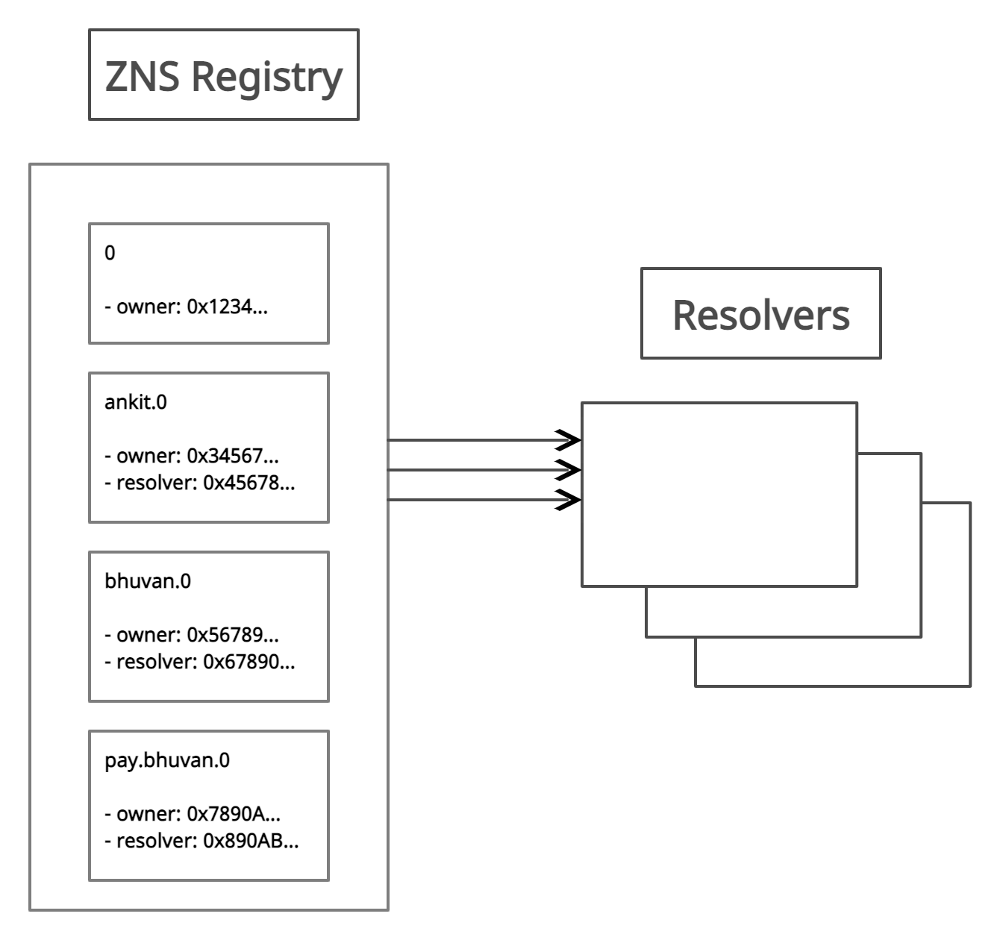

# Architecture

ZNS has two principal components: the registry and resolvers.

The ENS registry consists of a single smart contract that maintains a list of all domains and subdomains, and stores three critical pieces of information about each:

* The owner of the domain
* The resolver for the domain
* The caching time-to-live for all records under the domain

The owner of a domain may be either an external account (a user) or a smart contract. A registrar is simply a smart contract that owns a domain and issues subdomains of that domain to users that follow some set of rules defined in the contract.

Owners of domains in the ENS registry may:

* Set the resolver and TTL for the domain
* Transfer ownership of the domain to another address
* Change the ownership of subdomains

The ENS registry is deliberately straightforward and exists only to map from a name to the resolver responsible for it.

Resolvers are responsible for the actual process of translating names into addresses. Any contract that implements the relevant standards may act as a resolver in ENS. General-purpose resolver implementations are offered for users whose requirements are straightforward, such as serving an infrequently changed address for a name.

Each record type - cryptocurrency address, IPFS content hash, and so forth - defines a method or methods that a resolver must implement in order to provide records of that kind.&#x20;

Resolving a name in ENS is a two-step process: First, ask the registry what resolver is responsible for the name, and second, ask that resolver for the answer to your query.

